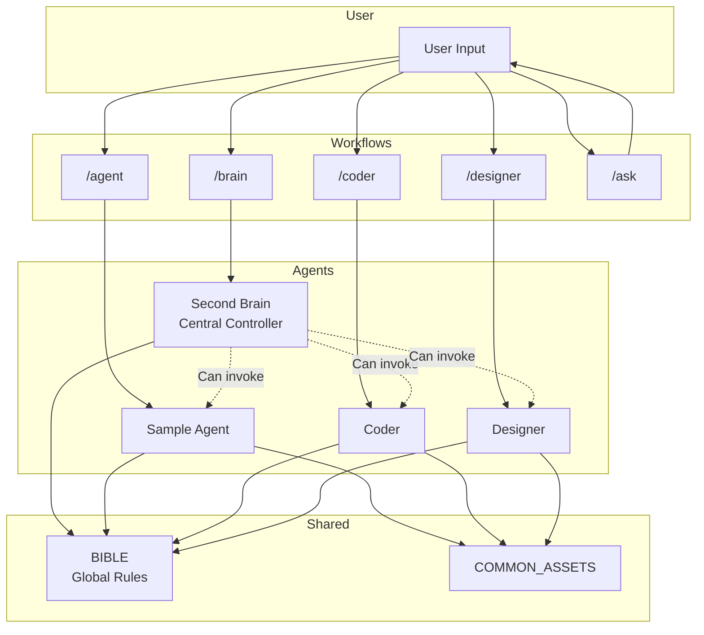
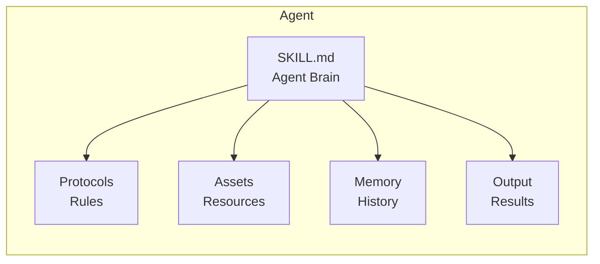
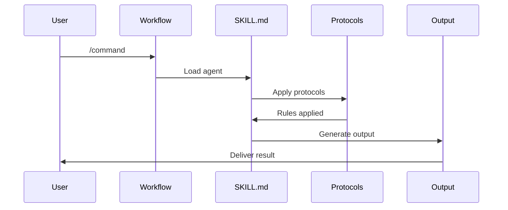

# 🏗️ Architecture Overview

Visual overview of how the agent ecosystem works.

---

## System Architecture



---

## Agent Internal Structure



---

## Workflow Flow



---

## Folder Hierarchy

```
Starter_Kit/
│
├── 📁 .agent/workflows/      <- Slash commands
│   ├── brain.md
│   ├── agent.md
│   └── ask.md
│
├── 📁 BIBLE/                 <- Global rules
│   ├── ABSOLUTE_RULES.md
│   └── entities/
│
├── 📁 Second_Brain/          <- Central controller
│   └── .agent/skills/
│       └── second_brain/
│           ├── SKILL.md
│           ├── context/
│           ├── protocols/
│           └── memory/
│
├── 📁 Sample_Agent/          <- Template agent
│   └── .agent/skills/
│       └── sample_agent/
│           ├── SKILL.md
│           ├── protocols/
│           └── assets/
│
└── 📁 Archetypes/           <- Pre-built agents
    ├── Coder/
    └── Designer/
```

---

## Data Flow

```
┌─────────────────────────────────────────────────────┐
│                    USER LAYER                        │
│  Commands (/brain, /coder) → Questions → Tasks      │
└─────────────────────────────────────────────────────┘
                          │
                          ▼
┌─────────────────────────────────────────────────────┐
│                  WORKFLOW LAYER                      │
│  Routes commands to appropriate agents               │
└─────────────────────────────────────────────────────┘
                          │
                          ▼
┌─────────────────────────────────────────────────────┐
│                   AGENT LAYER                        │
│  SKILL.md → Protocols → Assets → Generation          │
└─────────────────────────────────────────────────────┘
                          │
                          ▼
┌─────────────────────────────────────────────────────┐
│                  OUTPUT LAYER                        │
│  Generated content → Validation → Delivery           │
└─────────────────────────────────────────────────────┘
```

---

*Use this document to understand how all pieces connect.*
