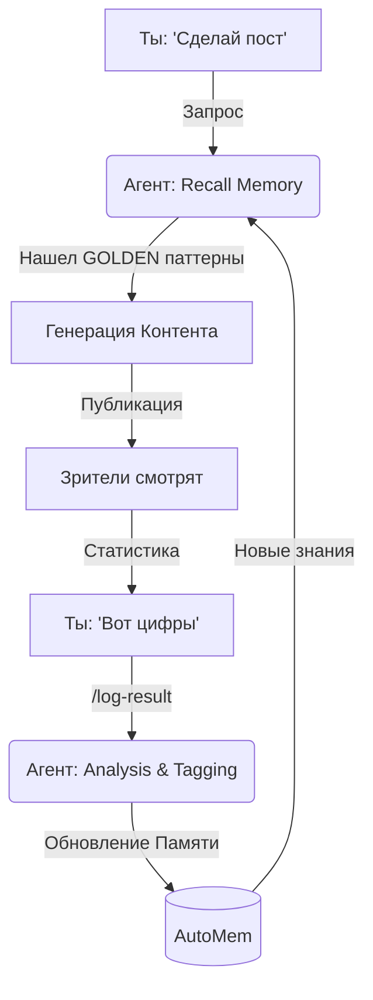

# ♾️ The Infinite Growth Cycle (`auto.md`)

Да, это точно. Твоя роль теперь — **Оператор**, а не чернорабочий.
Вся рутина (проверки, запоминание, анализ) автоматизирована.

Вот как работает наш Замкнутый Цикл:

---

## 🟢 Твоя часть (всего 2 действия)

### 1. 📢 "Сделай Контент"
Ты просто пишешь в чат: *"Eden, сделай вирусный пост про OpenAI"*.

### 2. 📊 "Вот результат"
Через 24 часа ты кидаешь скриншот или цифры: *"Набрало 50к, лайков 2000"*.

**(Всё. Больше ты ничего не делаешь.)**

---

## ⚙️ Что происходит "Под капотом" (Автоматически)

### Шаг 1: Агент Думает (Перед генерацией)
*   **Action:** Агент запускает `Recall`.
*   **Мысли:** *"Так, про OpenAI мы уже писали (вот ссылка). Пост был токсичным (Low Views). Значит, меняем тему на 'Секреты Альтмана', потому что тема 'Секреты' имеет тег `GOLDEN_PATTERN`."*
*   **Result:** Агент выдает тебе контент, который *уже* оптимизирован под прошлый опыт.

### Шаг 2: Агент Пишет
*   **Action:** Ты получаешь текст и видео-промпт.
*   **Automation:** Агент *сам* сохраняет черновик в память как "Попытка №X".

### Шаг 3: Агент Учится (После твоего скриншота)
*   **Action:** Ты запускаешь `/log-result` (или просто кидаешь скрин).
*   **Automation 1 (File Update):** Агент обновляет `results.md` и `performance_log.md`.
*   **Automation 2 (Memory Tagging):** Скрипт `log_performance.py` находит этот пост в базе и вешает ярлык:
    *   `GOLDEN` 🏆 (если успех)
    *   `TOXIC` ☠️ (если провал)
*   **Automation 3 (Sync):** Скрипт `sync_memory.py` загружает новые "правила успеха" в общее облако.

---

## 📈 Итог
С каждым циклом:
1.  База `GOLDEN` паттернов растет.
2.  База `TOXIC` ошибок растет (и мы их не повторяем).
3.  Агент становится **умнее** без твоего участия.

Ты просто кормишь его статистикой, а он "качает мышцы".

